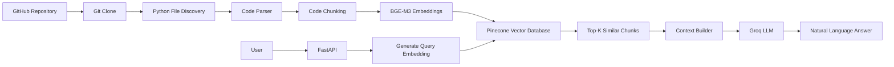
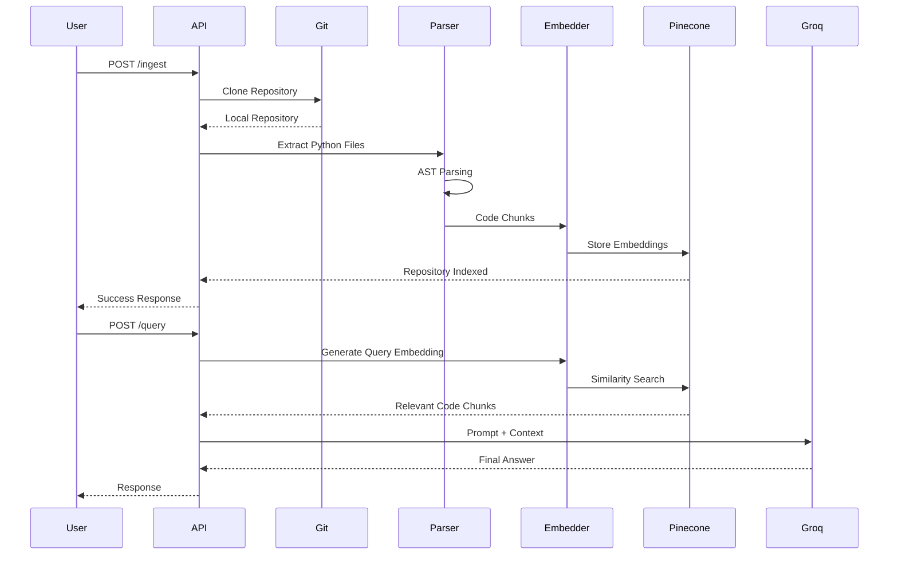
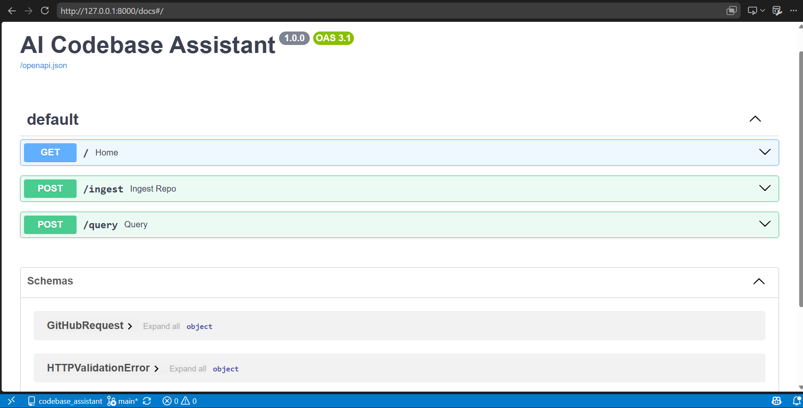
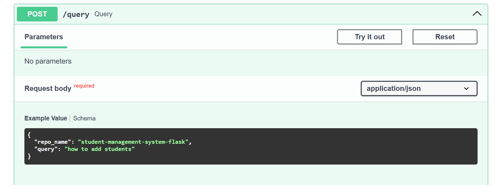

<div align="center">

# 🤖 AI Codebase Assistant

### **Understand Any GitHub Repository with AI**

<p align="center">
An AI-powered Retrieval-Augmented Generation (RAG) assistant that automatically clones GitHub repositories, parses source code, generates semantic embeddings, stores them in Pinecone, and answers developer questions using Groq LLM.
</p>

<p align="center">


</p>

---

### 🚀 Clone • Parse • Embed • Retrieve • Explain


</div>

---

# 📑 Table of Contents

- Overview
- Why AI Codebase Assistant?
- Features
- Architecture
- Workflow
- Folder Structure
- Tech Stack
- Installation
- Configuration
- API Documentation
- Example Usage
- Screenshots
- Future Roadmap
- Contributing
- License

---

# 🚀 Overview

Understanding an unfamiliar codebase is one of the most time-consuming tasks for developers.

Instead of manually searching through dozens (or hundreds) of files, **AI Codebase Assistant** allows you to ask natural language questions about any GitHub repository and receive accurate, context-aware answers.

The project uses a complete **Retrieval-Augmented Generation (RAG)** pipeline:

```
GitHub Repository
        │
        ▼
 Clone Repository
        │
        ▼
 Parse Source Code
        │
        ▼
 Generate Embeddings
        │
        ▼
 Store in Pinecone
        │
        ▼
 User Question
        │
        ▼
 Similarity Search
        │
        ▼
 Relevant Code Context
        │
        ▼
 Groq LLM
        │
        ▼
 Natural Language Answer
```

---

# 💡 Why This Project?

Modern repositories often contain:

- Thousands of lines of code
- Multiple folders
- Deep class hierarchies
- Complex business logic

Developers spend significant time understanding:

- Where a function is defined
- How authentication works
- Database interactions
- API endpoints
- Business workflows

This assistant removes that friction by allowing developers to simply ask:

> **"How does authentication work?"**

or

> **"Where are students added into the database?"**

and receive an explanation generated directly from the repository.

---

# ✨ Features

## 📂 Repository Ingestion

- Clone any public GitHub repository
- Automatic repository detection
- Local caching
- Incremental ingestion

---

## 📄 Intelligent Code Parsing

- Extract Python source files
- Ignore unnecessary files
- Function-level chunking
- Class-level chunking
- Metadata extraction

---

## 🧠 Semantic Embeddings

Uses

> **BAAI/bge-m3**

to generate high-quality semantic embeddings.

Each chunk contains metadata including

- Function Name
- Class Name
- File Path
- Line Numbers
- Code Content

---

## 📦 Pinecone Vector Database

Each code chunk is stored with

- Vector embedding
- Metadata
- Repository namespace

allowing multiple repositories to coexist in the same Pinecone index.

---

## 🔍 Semantic Search

Instead of keyword search,

the project performs

**Cosine Similarity Search**

to retrieve the most relevant code snippets.

---

## 🤖 Groq LLM Integration

Retrieved code snippets are supplied to Groq LLM, which generates developer-friendly explanations.

The assistant can explain

- Functions
- Classes
- APIs
- Database logic
- Business workflows
- Authentication
- CRUD operations
- Project architecture

---

## ⚡ FastAPI Backend

REST APIs

- Repository ingestion
- Query endpoint

Interactive Swagger documentation included.

---

# 🎯 Current Capabilities

✅ Clone GitHub repositories

✅ Parse Python projects

✅ Generate embeddings

✅ Store vectors in Pinecone

✅ Semantic retrieval

✅ Namespace support

✅ RAG pipeline

✅ Groq integration

✅ FastAPI backend

✅ Swagger UI

---

# 🏗️ System Architecture

AI Codebase Assistant follows a Retrieval-Augmented Generation (RAG) architecture that combines semantic search with Large Language Models to provide accurate, context-aware answers about a codebase.



---

# 🔄 End-to-End Workflow

The complete lifecycle of a repository inside the system.



---

# 📦 Retrieval-Augmented Generation (RAG)

```text
                    USER QUESTION
                           │
                           ▼
               Generate Query Embedding
                           │
                           ▼
              Pinecone Similarity Search
                           │
                           ▼
              Top 5 Relevant Code Chunks
                           │
                           ▼
               Build Prompt + Context
                           │
                           ▼
                     Groq LLM
                           │
                           ▼
                  Natural Language Answer
```

---

# 📁 Project Structure

```text
AI-Codebase-Assistant/
│
├── codebase_assistant/
│
│   ├── db/
│   │   ├── connection.py
│   │   ├── pinecone_db.py
│   │   └── __init__.py
│   │
│   ├── services/
│   │
│   │   ├── extraction/
│   │   │   ├── git_extraction.py
│   │   │   ├── content_extraction.py
│   │   │   └── parser.py
│   │   │
│   │   ├── retrieval.py
│   │   ├── embedding.py
│   │   └── llm.py
│   │
│   ├── models/
│   │
│   ├── schemas.py
│   │
│   ├── main.py
│   │
│   └── config.py
│
├── git_repos/
│
├── docs/
│   ├── architecture.png
│   ├── workflow.png
│   ├── swagger.png
│   ├── query-example.png
│   └── demo.gif
│
├── .env
├── requirements.txt
├── README.md
└── LICENSE
```

---

# ⚙️ Technology Stack

| Technology | Purpose |
|------------|---------|
| **Python** | Core Programming Language |
| **FastAPI** | REST API Framework |
| **Sentence Transformers** | Embedding Generation |
| **BAAI/bge-m3** | Semantic Embedding Model |
| **Pinecone** | Vector Database |
| **Groq API** | Large Language Model |
| **GitPython** | Git Repository Cloning |
| **AST Module** | Python Code Parsing |
| **Uvicorn** | ASGI Server |
| **Pydantic** | Request Validation |

---

# 🧠 Embedding Pipeline

Every code chunk passes through the following pipeline.

```text
Python File

↓

Parser

↓

Function/Class Extraction

↓

Semantic Chunk

↓

Metadata Attachment

↓

BGE-M3 Embedding

↓

1024-Dimensional Vector

↓

Pinecone Namespace
```

---

# 📌 Metadata Stored for Every Chunk

Each vector stored inside Pinecone contains both the embedding and rich metadata.

```json
{
    "id": "main.py:45",

    "metadata": {

        "repo_name":"student-management-system",

        "name":"add_student",

        "type":"function",

        "file_path":"main.py",

        "start_line":45,

        "end_line":72,

        "content":"def add_student(...): ..."
    }
}
```

This metadata allows the assistant to provide not only an explanation but also identify:

- Function Name
- Class Name
- File Location
- Repository Name
- Line Numbers
- Original Source Code

---

# 🗂 Namespace Strategy

Instead of creating a separate Pinecone index for every repository, AI Codebase Assistant stores each repository inside its own namespace.

```text
Pinecone Index
│
├── student-management-system
│
├── ecommerce-api
│
├── portfolio-website
│
└── chatbot-project
```

This approach provides:

- Better scalability
- Lower infrastructure cost
- Faster querying
- Easy repository isolation
- Simpler maintenance

---

# 🔍 Semantic Search Flow

```text
User Query

↓

Generate Embedding

↓

Cosine Similarity Search

↓

Top 5 Most Similar Chunks

↓

Merge Context

↓

Groq LLM

↓

Human-Friendly Explanation
```

---

# 📊 Why Semantic Search?

Unlike keyword search, semantic search understands the meaning behind the user's question.

### Example

**User asks**

```
How are students added?
```

Even if the repository contains

```python
def create_student():
```

or

```python
repository.insert_student()
```

the embedding model understands the semantic relationship and retrieves the relevant code without requiring an exact keyword match.

---

# 🚀 Performance Characteristics

| Component | Description |
|-----------|-------------|
| Embedding Model | BAAI/bge-m3 |
| Embedding Dimension | 1024 |
| Similarity Metric | Cosine Similarity |
| Vector Database | Pinecone |
| Top-K Retrieval | 5 Results |
| LLM | Groq |
| API Framework | FastAPI |
| Language | Python |

---

# 🚀 Installation

## 1. Clone the Repository

```bash
git clone https://github.com/<your-username>/AI-Codebase-Assistant.git

cd AI-Codebase-Assistant
```

---

## 2. Create Virtual Environment

### Windows

```bash
python -m venv .venv

.venv\Scripts\activate
```

### Linux / macOS

```bash
python3 -m venv .venv

source .venv/bin/activate
```

---

## 3. Install Dependencies

```bash
pip install -r requirements.txt
```

---

# 🔑 Environment Variables

Create a `.env` file in the project root.

```env
# Pinecone

PINECONE_API_KEY=your_pinecone_api_key

PINECONE_INDEX=codebase-assistant

# Groq

GROQ_API_KEY=your_groq_api_key

# Embedding Model

EMBEDDING_MODEL=BAAI/bge-m3
```

---

# ▶️ Running the Application

Start the FastAPI server.

```bash
uvicorn codebase_assistant.main:app --reload
```

If everything is configured correctly, you should see

```text
INFO:     Started server process

INFO:     Waiting for application startup.

INFO:     Application startup complete.

INFO:     Uvicorn running on http://127.0.0.1:8000
```

---

# 🌐 API Documentation

FastAPI automatically generates interactive API documentation.

Once the server is running, visit:

### Swagger UI

```
http://127.0.0.1:8000/docs
```

---

### ReDoc

```
http://127.0.0.1:8000/redoc
```

---

# 📥 Repository Ingestion API

Indexes a GitHub repository into Pinecone.

## Endpoint

```
POST /ingest
```

---

### Request Body

```json
{
    "repo_url":"https://github.com/Md-Danyal/student-management-system-flask"
}
```

---

### Success Response

```json
{
    "message":"Repository indexed successfully",

    "repository":"student-management-system-flask"
}
```

---

### What Happens Internally?

```text
Receive GitHub URL

↓

Clone Repository

↓

Extract Python Files

↓

Parse Functions & Classes

↓

Generate Semantic Chunks

↓

Create BGE-M3 Embeddings

↓

Store in Pinecone Namespace
```

---

# 💬 Query API

Ask questions about an indexed repository.

---

## Endpoint

```
POST /query
```

---

### Request

```json
{
    "repo_name":"student-management-system-flask",

    "query":"How do I add students?"
}
```

---

### Response

```json
{
    "answer":"The StudentRepo class contains an add_students() method responsible for inserting student records into the database. The method constructs an SQL INSERT statement using SQLAlchemy and commits the transaction using the MySQL engine."
}
```

---

# 🔄 Query Execution Flow

```text
User Question

↓

Generate Query Embedding

↓

Pinecone Similarity Search

↓

Retrieve Top 5 Code Chunks

↓

Build Context

↓

Send Context to Groq

↓

Generate Final Answer
```

---

# 📚 Example Queries

The assistant can answer a wide variety of developer questions.

### Database

```
How are students stored?
```

---

### Authentication

```
How does login work?
```

---

### CRUD

```
How are students updated?
```

---

### API

```
What endpoints are available?
```

---

### Project Architecture

```
Explain the project structure.
```

---

### Code Navigation

```
Where is StudentRepo defined?
```

---

### Business Logic

```
How are duplicate students prevented?
```

---

### Search

```
Which function deletes a student?
```

---

# 📷 Screenshots

## Swagger UI

> Replace with your screenshot.

```markdown

```

---

## Architecture Diagram

```markdown

```

---

## Query Example

```markdown

```

---

# 🎯 Example Session

### Step 1

Index a repository.

```http
POST /ingest
```

↓

Repository indexed successfully.

---

### Step 2

Ask a question.

```text
How do I add students?
```

---

### Step 3

Semantic Retrieval

```text
Top 5 Similar Code Chunks Retrieved
```

---

### Step 4

Groq LLM receives

- User Question
- Retrieved Context
- Repository Metadata

---

### Step 5

Natural language answer returned to the user.

---

# 💡 Tips

- Use descriptive questions for better retrieval.
- Re-index a repository after major code changes.
- Keep repository namespaces unique.
- Ensure your Pinecone index dimension matches the embedding model (1024 for `BAAI/bge-m3`).

---

# 🧪 Testing the API

Using **cURL**:

```bash
curl -X POST http://127.0.0.1:8000/query \
-H "Content-Type: application/json" \
-d '{
  "repo_name":"student-management-system-flask",
  "query":"Explain the add_students method"
}'
```

---

Using **Postman**:

1. Create a new **POST** request.
2. Set the URL to `http://127.0.0.1:8000/query`.
3. Add the `Content-Type: application/json` header.
4. Paste the JSON request body.
5. Click **Send**.

---

> **You're now ready to ingest repositories and ask questions about them using natural language.**

---

# 📖 Usage

After starting the FastAPI server, open the interactive API documentation:

```
http://127.0.0.1:8000/docs
```

---

## 1️⃣ Ingest a GitHub Repository

This endpoint downloads a public GitHub repository, extracts the Python code, creates embeddings using **BAAI/bge-m3**, and stores them inside **Pinecone**.

### Endpoint

```
POST /ingest
```

### Request

```json
{
    "repo_url": "https://github.com/username/project"
}
```

### Response

```json
{
    "message": "Repository indexed successfully."
}
```

---

## 2️⃣ Ask Questions

Once a repository has been indexed, users can ask natural language questions.

### Endpoint

```
POST /query
```

### Request

```json
{
    "repo_name": "project-name",
    "query": "How are users authenticated?"
}
```

### Response

```json
{
    "answer": "Authentication is implemented using JWT..."
}
```

---

# 💬 Example Questions

The assistant understands natural language.

Examples:

```
How does authentication work?

Explain the Product model.

Where are SQL queries written?

How do I add a student?

Which function updates user data?

Explain this repository.

Show me database logic.

Where is Flask initialized?

How is routing handled?

Explain repository.py
```

---

# 🧠 Retrieval Pipeline

```
User Question
      │
      ▼
Generate Query Embedding
      │
      ▼
Pinecone Similarity Search
      │
      ▼
Top Relevant Code Chunks
      │
      ▼
Prompt Construction
      │
      ▼
Groq LLM
      │
      ▼
AI Answer
```

---

# 📁 Project Structure

```
codebase_assistant/
│
├── db/
│   ├── connection.py
│   ├── pinecone_db.py
│
├── llm/
│   └── groq_service.py
│
├── models/
│   └── request_models.py
│
├── services/
│   ├── embedding.py
│   ├── retrieval.py
│   └── extraction/
│       ├── git_extraction.py
│       ├── content_extraction.py
│       └── parser.py
│
├── main.py
│
├── .env
├── requirements.txt
└── README.md
```

---

# ⚙️ Configuration

Create a `.env` file.

```env
PINECONE_API_KEY=xxxxxxxxxxxxxxxx
PINECONE_INDEX_NAME=codebase-assistant

GROQ_API_KEY=gsk_xxxxxxxxxxxxx

HF_TOKEN=xxxxxxxxxxxxxxxx
```

---

# 🔍 Retrieval Details

Embedding Model

```
BAAI/bge-m3
```

Vector Database

```
Pinecone
```

Similarity Search

```
Cosine Similarity
```

LLM

```
Groq
```

Framework

```
FastAPI
```

---

# 🎯 Current Features

✅ GitHub Repository Cloning

✅ Python Code Parsing

✅ Function Extraction

✅ Class Extraction

✅ Metadata Generation

✅ Embedding Generation

✅ Pinecone Vector Storage

✅ Namespace Isolation

✅ Semantic Search

✅ Retrieval-Augmented Generation (RAG)

✅ FastAPI Backend

✅ Groq LLM Integration

✅ Interactive Swagger Documentation

---